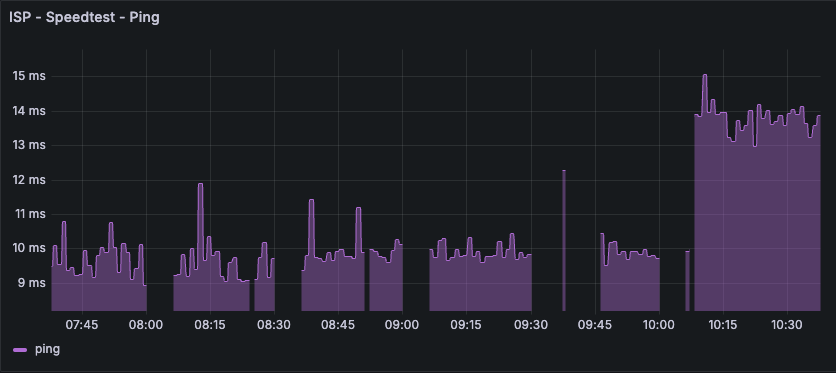

# speedtest_exporter

Prometheus Exporter in Python to colect metrics from speedtest about your internet provider

## Badges

[![python][python-badge]][python-version] ![pylint-score]

## Setup

### Resolving Dependencies

```sh
pip3 install -r requirements.txt
```

| Option         | Mandatory?        | Description          |
|----------------|-------------------|----------------------|
| **-p, --port** | No. Default: 8042 | App Port             |
| **-h, --help** | No                | Show help like below |

### Systemd

Change the path to this script in the file file to `speedtest_exporter.service`, change informations from command-line options and follow the steps to configure the script to run like a [systemd] service.

### Known Error

The [Speed Test library] used in this script uses by default HTTP connection to run some tests, to ensure HTTPS running everytime you have to pass "_secure=True_" parameter like this `speedtest.Speedtest(secure=True)`.

This solution ensure execution without errors, but also it tends to increase the ping latency as it show below:



For notice, if the "security" parameter is not passed to the library, it's possible to see a decrease in "_Ping latency_" data, but also some gaps in the graph and some error lines in the script log:

```
Nov 03 19:00:50 localhost speedtest_exporter[776]: Exception occurred during processing of request from ('127.0.0.1', 42870)
Nov 03 19:00:50 localhost speedtest_exporter[776]: Traceback (most recent call last):
Nov 03 19:00:50 localhost speedtest_exporter[776]:   File "/usr/lib/python3.9/socketserver.py", line 650, in process_request_thread
Nov 03 19:00:50 localhost speedtest_exporter[776]:     self.finish_request(request, client_address)
Nov 03 19:00:50 localhost speedtest_exporter[776]:   File "/usr/lib/python3.9/socketserver.py", line 360, in finish_request
Nov 03 19:00:50 localhost speedtest_exporter[776]:     self.RequestHandlerClass(request, client_address, self)
Nov 03 19:00:50 localhost speedtest_exporter[776]:   File "/usr/lib/python3.9/socketserver.py", line 720, in __init__
Nov 03 19:00:50 localhost speedtest_exporter[776]:     self.handle()
Nov 03 19:00:50 localhost speedtest_exporter[776]:   File "/usr/lib/python3.9/http/server.py", line 427, in handle
Nov 03 19:00:50 localhost speedtest_exporter[776]:     self.handle_one_request()
Nov 03 19:00:50 localhost speedtest_exporter[776]:   File "/usr/lib/python3.9/http/server.py", line 415, in handle_one_request
Nov 03 19:00:50 localhost speedtest_exporter[776]:     method()
Nov 03 19:00:50 localhost speedtest_exporter[776]:   File "/home/service/.local/lib/python3.9/site-packages/prometheus_client/exposition.py", line 152, in do_GET
Nov 03 19:00:50 localhost speedtest_exporter[776]:     output = encoder(registry)
Nov 03 19:00:50 localhost speedtest_exporter[776]:   File "/home/service/.local/lib/python3.9/site-packages/prometheus_client/openmetrics/exposition.py", line 14, in generate_latest
Nov 03 19:00:50 localhost speedtest_exporter[776]:     for metric in registry.collect():
Nov 03 19:00:50 localhost speedtest_exporter[776]:   File "/home/service/.local/lib/python3.9/site-packages/prometheus_client/registry.py", line 75, in collect
Nov 03 19:00:50 localhost speedtest_exporter[776]:     for metric in collector.collect():
Nov 03 19:00:50 localhost speedtest_exporter[776]:   File "/home/service/speedtest_exporter/speedtest_exporter", line 57, in collect
Nov 03 19:00:50 localhost speedtest_exporter[776]:     speed_test_executor = speedtest.Speedtest()
Nov 03 19:00:50 localhost speedtest_exporter[776]:   File "/home/service/.local/lib/python3.9/site-packages/speedtest.py", line 1095, in __init__
Nov 03 19:00:50 localhost speedtest_exporter[776]:     self.get_config()
Nov 03 19:00:50 localhost speedtest_exporter[776]:   File "/home/service/.local/lib/python3.9/site-packages/speedtest.py", line 1127, in get_config
Nov 03 19:00:50 localhost speedtest_exporter[776]:     raise ConfigRetrievalError(e)
Nov 03 19:00:50 localhost speedtest_exporter[776]: speedtest.ConfigRetrievalError: HTTP Error 403: Forbidden
```

Eighterway, take the "_Ping latency_" information more as a reference than an acurated ping information since this is a recomendation from the [library creator itself](https://github.com/sivel/speedtest-cli?tab=readme-ov-file#inconsistency)

## Command-line Options

```sh
# speedtest_exporter
usage: speedtest_exporter [-h] [-p [PORT]]

optional arguments:
  -h, --help            show this help message and exit
  -p [PORT], --port [PORT]
                        Port, default: 8042
```

## Prometheus Configuration

Add the job below to your Prometheus Configuration File to scrape the app metrics.

```yml
- job_name: 'speed_test'
    scheme: http # change to http if you don't have https
    metrics_path: '/metrics'
    scrape_timeout: 1m
    scrape_interval: 1m
    static_configs:
      - targets:
        - mytarget
    relabel_configs:
      - source_labels: [__address__]
        target_label: __param_target
      - source_labels: [__param_target]
        target_label: instance
      - target_label: __address__
        replacement: 127.0.0.1:8042 # Change here with your real exporter address:port
```

## Grafana Dashboard

Import the file "speedtest_dashboard.json" to your Grafana.

## Docker

Soon.

## Maintainer

 [Reinaldo Lima]

## License

See LICENSE file

[//]: #

[python-badge]: https://img.shields.io/badge/python-3.7.3-blue
[python-version]: https://www.python.org/downloads/release/python-373/
[pylint-score]: https://mperlet.github.io/pybadge/badges/9.18.svg
[Speed Test library]: https://github.com/sivel/speedtest-cli
[Reinaldo Lima]: https://github.com/reimlima
[systemd]: https://wiki.debian.org/systemd/Services
[YAML]: https://en.wikipedia.org/wiki/YAML